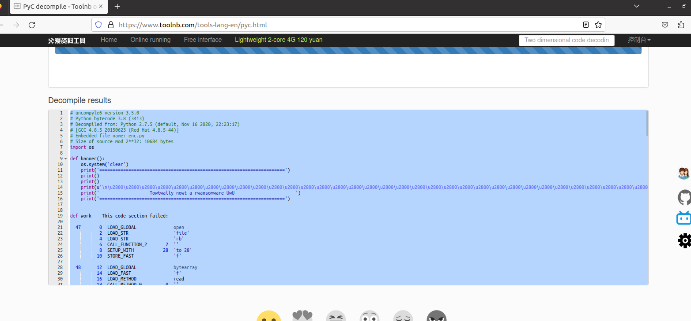
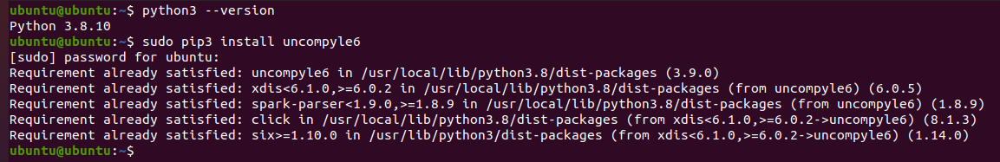
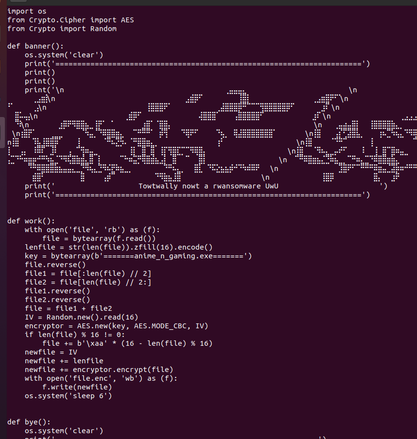

## Decompiling the pyc
We're given a `.pyc` file. If we google it, we'll find that it's a compiled python file. We can't read it directly, but we can decompile it.
Hence, we try to decompile it online.

As we can see, it can't decompile the work function, which is where most of the encrpytion is happening. However, it does identify it as python 3.8.

If you google `Python 3,.8 Decompilation`, you'll fing the `uncompyle6` libraty. Hence, we install `uncompyle6` and then try to decompyle it ourselves on a machine having `python3.8`.

Here we see that it successfully decompiles the work function. Now, with the encryptor with ourselves, let's try to decrypt it.

PS: Self-explanatory [dec.py](dec.py)
